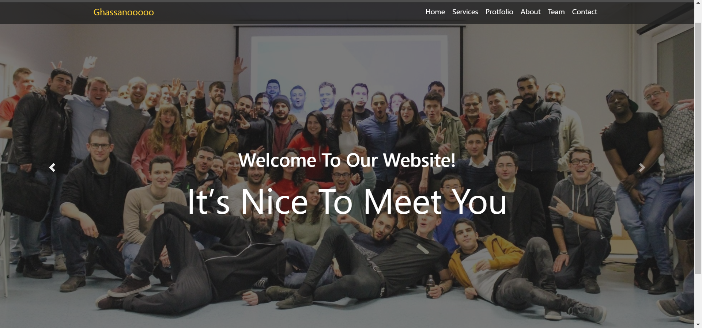

# myPortfolio_2_React




> A quick walkthrough of my myPortfolio_2_React app built using React, React Router, and Redux


## See it live

[myPortfolio_2_React live on heroku]( https://ghassanaldarwish.de)

## Quick Start

```bash
# Install dependencies for server
npm install


# Run the client 
npm start


# client run on http://localhost:3000
```


## App Info

### Author

Ghassan Aldarwish
[my website](http://ghassanaldarwish.de/)

### Version

1.0.0

### License

This project is licensed under the MIT License
